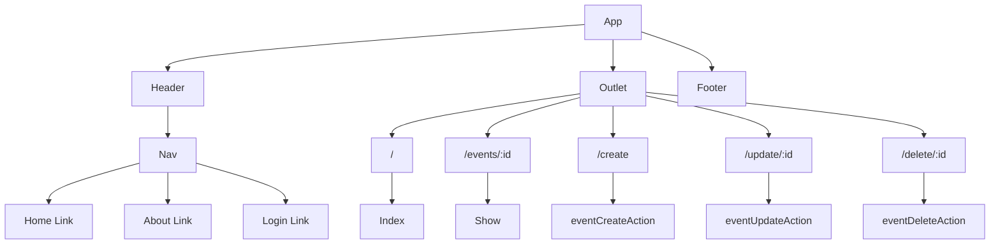

# MyEvents

- **Creators:** Cindy Wong, Karen Fernander, Rene Santiago, Alexei Rusu
- **Description:** 
“MyEvents” is a frontend React application that allows users to view, create, delete, and update events. The app features user authentication, ensuring that only authorized users can access and manipulate event information. The user interface is intuitive and easy to navigate, allowing users to quickly and efficiently manage their events. Additionally, the application integrates with a backend service to securely store and retrieve event data. Overall, “MyEvents” is a powerful and user-friendly tool for managing events and keeping track of important dates and deadlines.
- **technologies used**:
  * React
  * react-router-dom
  * sass

## Component Architecture

### Frontend Route Table
|    Route    | Element |    Loader   |       Action      |              Description                     |
|-------------|---------|-------------|-------------------|----------------------------------------------|
|      /      |  Index  | indexLoader |                   | Loads up list of events                      |
| /event/:id  |  Show   | eventLoader |                   | Loads up a specific event                    |
|   /create   |  Create |             | eventCreateAction | Handles submission of create form for events |
| /update/:id |  Update |             | eventUpdateAction | Handles submission of update form for events |
| /delete/:id |  Delete |             | eventDeleteAction | Handles submission of delete form for events |

## Mockups

### Desktop Mockup

### Mobile Mockup

  

* [Deployed Website](https://myevents-s.netlify.app/) 